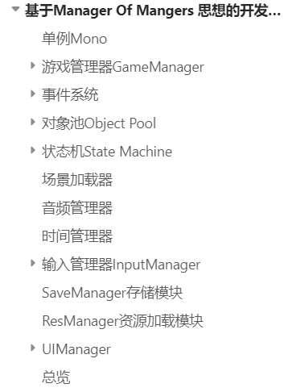

Script文件夹下存放了所有的脚本

unitypackage文件夹下面包含了脚本以及示例（以后会补全，也许！）

# 总览

## 单例Mono

## 游戏管理器GameManager

用到一个枚举代表游戏的多种状态。

## 事件系统Event

1、使用字典的实现：EventCenter

2、使用ScriptableObject的实现：EventChannel

## 对象池Object Pool

1、预先装载的对象池Pool+PoolManager

2、随使用而创建的对象池ObjectPool

## 状态机StateMachine

1、使用ScriptableObject的实现：单个的玩家/单实例的对象，方便管理数据。

2、使用多实例类型的实现：敌人/npc。

## 场景加载器SceneLoader

加载场景时使用淡入淡出的简单效果。

通常是通过修改某个UI图片的透明度来实现的。

通过异步加载来减少卡顿。

## 音频管理器AudioManager

使用音频管理器方便地在任何地方播放音频。

创建AudioData/AudioData数组用于传入音频。

可以用PlaySFX播放的UI音效->实现是PlayOneShot

使用PlayRandomSFX播放重复的音频->实现是随机改变音高后PlayOneShot

## 时间控制器TimeController

主要用于管理timescale，实现子弹时间的效果

## 输入管理器InputManager

使用Input System->创建Input Actions->创建控制方案->生成接口代码->继承实现

1、通过事件订阅获取玩家输入。（订阅者模式）

2、通过Input Action API获取玩家输入。

## 存储管理器SaveManager

想要保存一些简单的数据->使用playfab/json实现简易的保存。

## 资源加载模块ResManager

资源加载，已经很少用了？因为市面上有更加成熟的解决方案。

## 用户接口管理UIManager

1、基本面板

2、UI管理器

3、状态条

在处理角色生命值系统的地方（或者其他任何能够用到类状态条的地方），遇到需要更新UI的时候，调用StatsBar_HUD的UpdateStats方法，传入两个参数来更新状态条。

第一个参数为当前值（需要更新到的值）

第二个参数为该状态条的最大值
