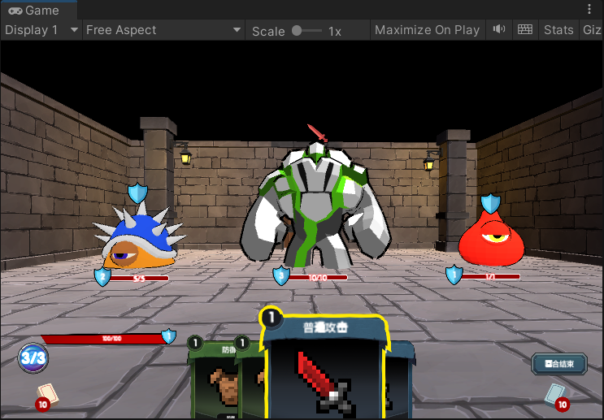
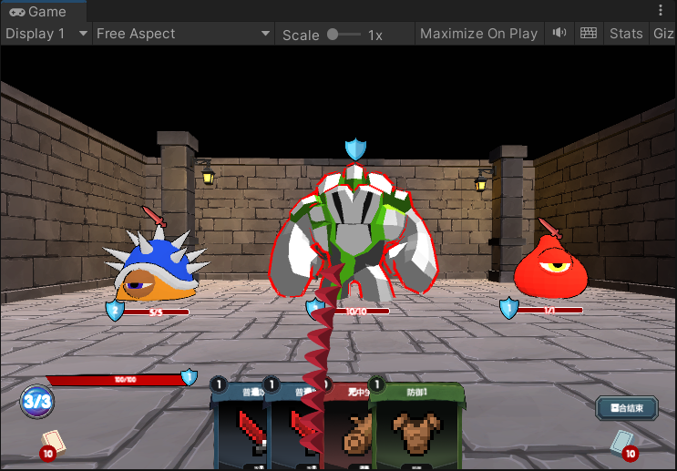

# A Card Game Fork the fight likes Slay The Spire

4.13 - 4.14

Tutorial Link Here：

[[Unity教程]仿杀戮尖塔卡牌游戏教程（完结）_哔哩哔哩_bilibili](https://www.bilibili.com/video/BV1eF41177hu/?spm_id_from=333.1007.top_right_bar_window_custom_collection.content.click&vd_source=56e8fdea1840126840d1260a558908b9)

## 一个关于复刻杀戮尖塔战斗的卡牌游戏。

学习复刻了其中的意图系统、卡组系统、能量消耗系统、回合轮转、卡牌效果等。

卡牌游戏比较看重UI，着重了解一下事件机制以及UI的更新等。

如果没有制作过卡牌游戏的是个不错的入门项目，但是对于有过些许项目经验的：

可以知道的是到这个项目的程序耦合严重，想要改的话相当有难度。

但是了解到一些基础的回合轮转、制作卡牌效果等基础也是不错的。

如果你需要项目资源，可以去视频底下寻找链接，或需要下载origin结尾的unitypackage即可(_Excel是配置文件，不要忘记导入)，这里我直接提供了完整的项目。

## Translation Here：

A card game about a duplicate killing spire battle.

Learn to copy the intention system, card group system, energy consumption system, turn rotation, card effect and so on.

Card games focus on the UI, so focus on event mechanics and UI updates.

It's a good starting project if you haven't made a card game before, but for those with some project experience:

It is known that the program is heavily coupled to this project, and it is quite difficult to change it.

But it's also good to know the basics of turn rotation, crafting card effects, etc.

If you need project resources, you can go to the bottom of the video and look for the link, or you can download the unitypackage ends with "origin"（Excel is a configuration file, so don't forget to import it）. I've provided the full project here.

Thanks!

## About

我写的脚本并不完整！只是作为部分系统的了解。

当然，这个项目作为教程来说还是不错的，但是作为游戏原型的话就相当糟糕了。

缺漏的部分：

- 没有更新抽牌堆和弃牌堆，你的牌可能两个回合就打完了。

- 并且你后面的回合不会抽到任何牌。

- 胜利/失败的逻辑。

- 你可以自己尝试着完成上面的脚本。

为什么不写完？

-这个系统耦合度相当高，根本不可能去维护。

-太重配置，许多地方都要配置，配置又要遵循某些规则。

-路径写得太死，稍有差错就会报空指针，这是相当头痛的。
