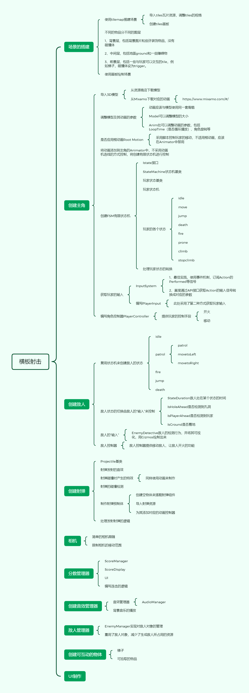

# 横板平台射击总览

该项目的制作起因来自于：

该项目的制作过程：

1、搭建场景（tilemap）

[MegaBot Areas Pack 1 | 2D 环境 | Unity Asset Store](https://assetstore.unity.com/packages/2d/environments/megabot-areas-pack-1-195249)

2、制作可操控的玩家（3D模型-骨骼动画-状态机-角色控制器）

[Characters Pack - FREE by elvismd (itch.io)](https://elvismd.itch.io/characters-pack-free)

添加骨骼动画

[Mixamo](https://www.mixamo.com/#/)

编写状态机以及角色控制器

3、创建射弹

[Warped Shooting Fx | 2D 抽象 | Unity Asset Store](https://assetstore.unity.com/packages/2d/textures-materials/abstract/warped-shooting-fx-195246)

4、创建敌人

5、创建爬梯和角色爬梯状态

6、通过状态机制作简单的ai

7、简单的相机控制

8、绘制程序架构图

由于过于简陋（就没有演示图和完整项目展示了。
