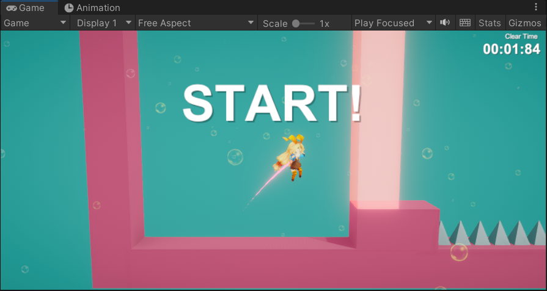
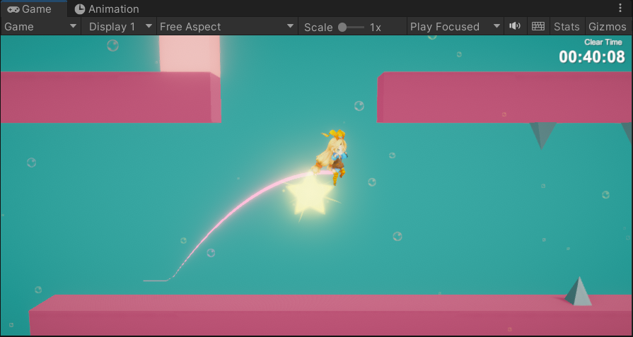
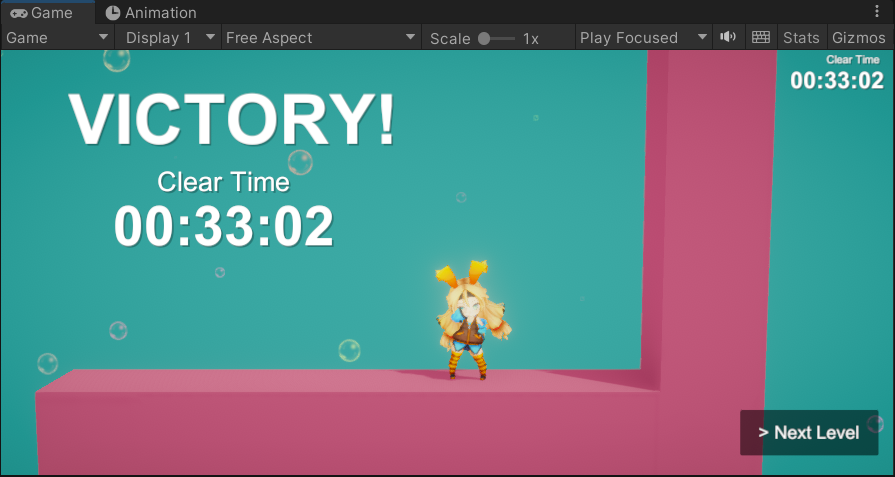
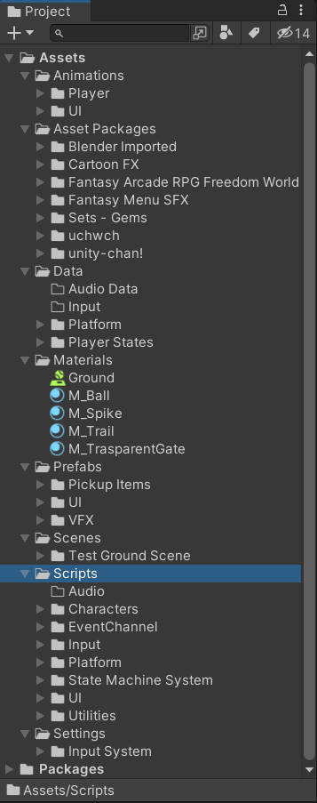
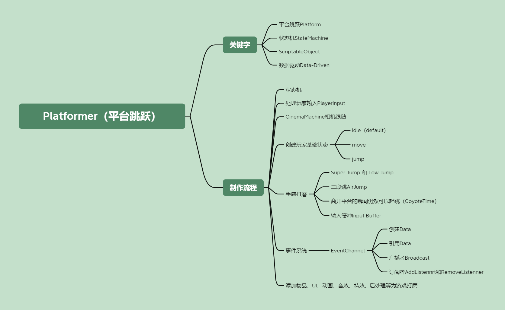

## Platformer Protocol（平台跳跃类游戏原型）

## 总览

---

# 制作流程

### 编写基础状态机

### 处理玩家输入PlayerInput

### CinemaMachine相机跟随以及状态驱动

### 创建玩家基础状态

- idle（default）
- move
- jump

### 手感打磨

- Super Jump 和 Low Jump
- 二段跳AirJump
- 离开平台的瞬间仍然可以起跳（CoyoteTime）
- 输入缓冲Input Buffer

### 事件系统

- EventChannel
  
  - 创建Data
  - 引用Data
  - 广播者Broadcast
  - 订阅者AddListennrt和RemoveListenner

### 添加物品、UI、动画、音效、特效、后处理等为游戏打磨

---

# Resources

## Refference（参考）

[【阿严】[Unity]平台跳跃游戏 角色控制器 教程合集 | 状态机架构 | Platformer Controller Tutorial Collection_哔哩哔哩_bilibili](https://www.bilibili.com/video/BV1a14y1a72w/?spm_id_from=333.788&vd_source=56e8fdea1840126840d1260a558908b9)
