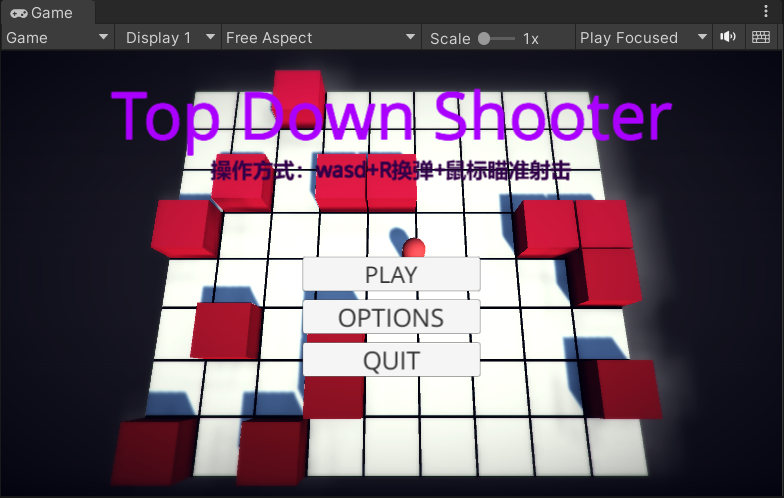
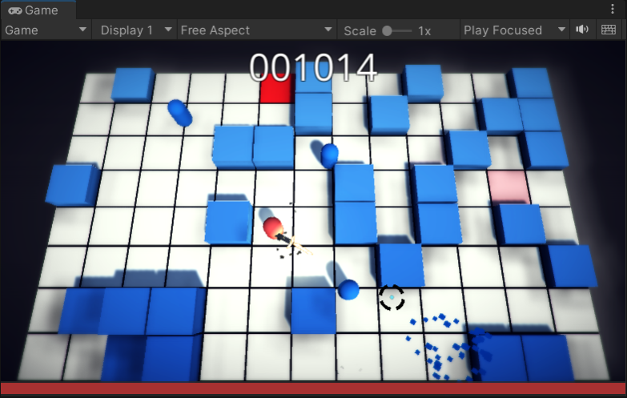
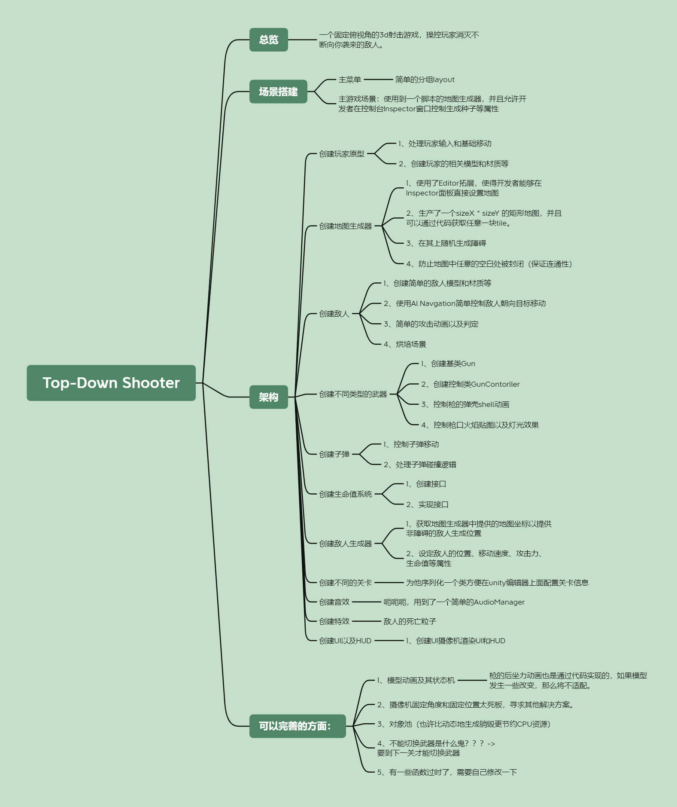
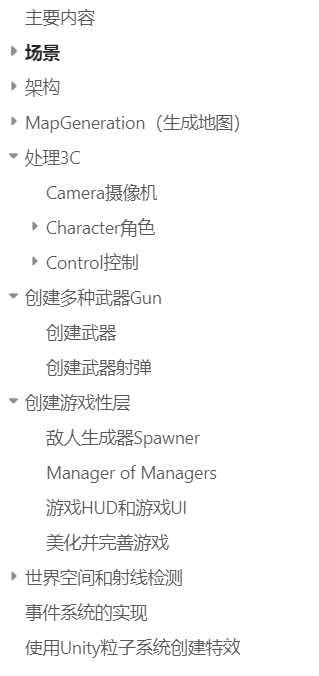

# Top-Down Shooter

## 总览（学习笔记）

### 一个固定俯视角的3d射击游戏原型，操控玩家消灭不断向你袭来的敌人。

## 场景搭建

### 主菜单

- 简单的分组layout

### 主游戏场景：使用到一个脚本的地图生成器，并且允许开发者在控制台Inspector窗口控制生成种子等属性

## 架构

### 创建玩家原型

- 1、处理玩家输入和基础移动
- 2、创建玩家的相关模型和材质等

### 创建地图生成器

- 1、使用了Editor拓展，使得开发者能够在Inspector面板直接设置地图
- 2、生产了一个sizeX * sizeY 的矩形地图，并且可以通过代码获取任意一块tile。
- 3、在其上随机生成障碍
- 4、防止地图中任意的空白处被封闭（保证连通性）

### 创建敌人

- 1、创建简单的敌人模型和材质等
- 2、使用AI.Navgation简单控制敌人朝向目标移动
- 3、简单的攻击动画以及判定
- 4、烘培场景

### 创建不同类型的武器

- 1、创建基类Gun
- 2、创建控制类GunContorller
- 3、控制枪的弹壳shell动画
- 4、控制枪口火焰贴图以及灯光效果

### 创建子弹

- 1、控制子弹移动
- 2、处理子弹碰撞逻辑

### 创建生命值系统

- 1、创建接口
- 2、实现接口

### 创建敌人生成器

- 1、获取地图生成器中提供的地图坐标以提供非障碍的敌人生成位置
- 2、设定敌人的位置、移动速度、攻击力、生命值等属性

### 创建不同的关卡

- 为他序列化一个类方便在unity编辑器上面配置关卡信息

### 创建音效

- 呃呃呃，用到了一个简单的AudioManager

### 创建特效

- 敌人的死亡粒子

### 创建UI以及HUD

- 1、创建UI摄像机渲染UI和HUD

## 可以完善的方面：

1、模型动画及其状态机

- 枪的后坐力动画也是通过代码实现的，如果模型发生一些改变，那么将不适配。

2、摄像机固定角度和固定位置太死板，寻求其他解决方案。

3、添加对象池（比动态地生成销毁更节约CPU资源）

4、不能切换武器是什么鬼？？？->要到下一关才能切换武器

5、有一些函数过时了，需要自己修改一下
