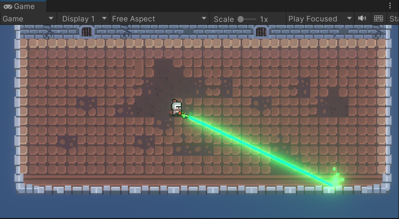
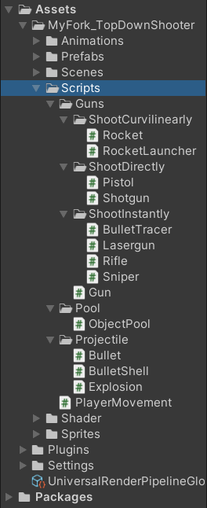
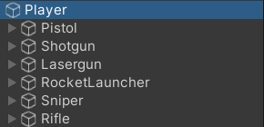

### 

# 总览

## 对象池

实现了一个runtime类型的对象池。

在运行时根据需要生成、回收游戏物体。

## 创建不同类型的射弹

1、线性射弹

2、曲线射弹

上面两种射弹都使用实体子弹进行射击。

3、激光子弹

4、模拟子弹轨迹

使用射线检测的方式进行射击判断。

## 创建不同种类的发射枪械

1、Pistol模拟了单个实体子弹。

2、Shotgun模拟的是多个实体子弹。

3、Lasergun是激光枪

4、RocketLauncher是使用曲线子弹的。

5、Sniper和Rifle都是基于模拟子弹轨迹的。

## 创建了一个枪械基类（可复用于类似的项目）

## 使用了后处理效果为枪械添加发光特效

---

### 如果你也尝试去完成这个项目，请尽量到原项目地址下载

因为我使用了原项目的场景，又复制了一份Spite文件夹中所有文件来制作动画...

这是非常错误的做法！！！

注意：尽量直接创建URP项目，避免后面升级项目带来材质损坏等问题。

---

资源链接（Link）：

[使用Unity制作俯视角射击游戏_哔哩哔哩_bilibili](https://www.bilibili.com/video/BV1xb4y1D7PZ/?spm_id_from=333.880.my_history.page.click&vd_source=56e8fdea1840126840d1260a558908b9)

[使用Unity制作多种射击效果_哔哩哔哩_bilibili](https://www.bilibili.com/video/BV1Mh411v7PU/?spm_id_from=333.788.recommend_more_video.-1&vd_source=56e8fdea1840126840d1260a558908b9)

[奥飒姆_Awesome的个人空间-奥飒姆_Awesome个人主页-哔哩哔哩视频 (bilibili.com)](https://space.bilibili.com/641773200)

github上面关注他->[RedFF0000 (awesome) (github.com)](https://github.com/RedFF0000)

这个博主的教程全是干货，就是不知道为啥不更新了...

他的动画状态机教程也不错->[RedFF0000/Finite-state-machine (github.com)](https://github.com/RedFF0000/Finite-state-machine)

---

素材链接：
https://o-lobster.itch.io/simple-dungeon-crawler-16x16-pixel-pack
https://humanisred.itch.io/weapons-and-bullets-pixel-art-asset

本期视频内容：
Unity2D下的直线射击
使用对象池进行性能优化

原项目链接：
[RedFF0000/TopDownShooter (github.com)](https://github.com/RedFF0000/TopDownShooter)
