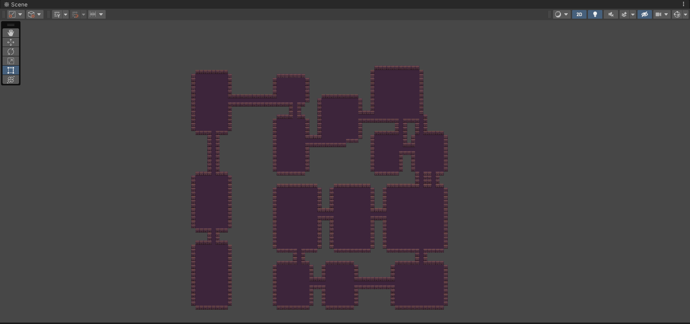

# 项目简介

简单地复刻了用程序来生成地牢。

项目完成度：80%

最后面的程序生成墙体没有做，也许可以使用rule-tile的功能替代？

也许后面会选择其他的生成方法，比如说制作地图预制体来生成地牢（参考[元气骑士 - 维基百科，自由的百科全书 (wikipedia.org)](https://zh.wikipedia.org/wiki/%E5%85%83%E6%B0%94%E9%AA%91%E5%A3%AB)）

这些程序有很大的优化空间，比如说，在生成走廊的时候可以使用一个指针来保存上一次生成走廊时的方向，避免下一次生成时

有空的时候会来做更新优化的！！！（也许）

---

# 一些链接

原项目地址：[SunnyValleyStudio/Unity_2D_Procedural_Dungoen_Tutorial: Using RAndom Wlak and Binary Space partitioning to create a 2D procedural dungeon in Unity 2020 (github.com)](https://github.com/SunnyValleyStudio/Unity_2D_Procedural_Dungoen_Tutorial)

国内的转载：[介绍_哔哩哔哩_bilibili](https://www.bilibili.com/video/BV1Ee4y1W7Uu?p=1&vd_source=56e8fdea1840126840d1260a558908b9)

https://www.youtube.com/watch?app=desktop&v=-QOCX6SVFsk&list=PLcRSafycjWFenI87z7uZHFv6cUG2Tzu9v&index=1

转载自油管Sunny Valley Studio，链接以上

### 原标题：

Unity Procedural Generation of a 2D Dungeon

### 原简介：

Learn how to procedurally generate a 2D dungeon in Unity using Random Walk and Binary Space Partitioning algorithms! In this tutorial we will use unity Tilemaps to create single and multi room dungeons connected by corridors using Corridors First and Rooms first approaches. 

学习如何使用随机游走和二叉空间划分（BSP）算法在Unity中生成一个2D地牢！在本教程中，我们将使用Unity瓦片地图来创建单个和多个房间的地下城，并使用走廊优先和房间优先的方法连接走廊。

### Resources

https://github.com/SunnyValleyStudio/Unity_2D_Procedural_Dungoen_Tutorial
Learn more from about Unity Game Dev in my video courses at:
https://courses.sunnyvalleystudio.com/

### Assets used（用到的素材）:

https://pixel-poem.itch.io/dungeon-assetpuck

You can support me through Patreon（赞助原作者）:
https://www.patreon.com/sunnyvalleystudio
